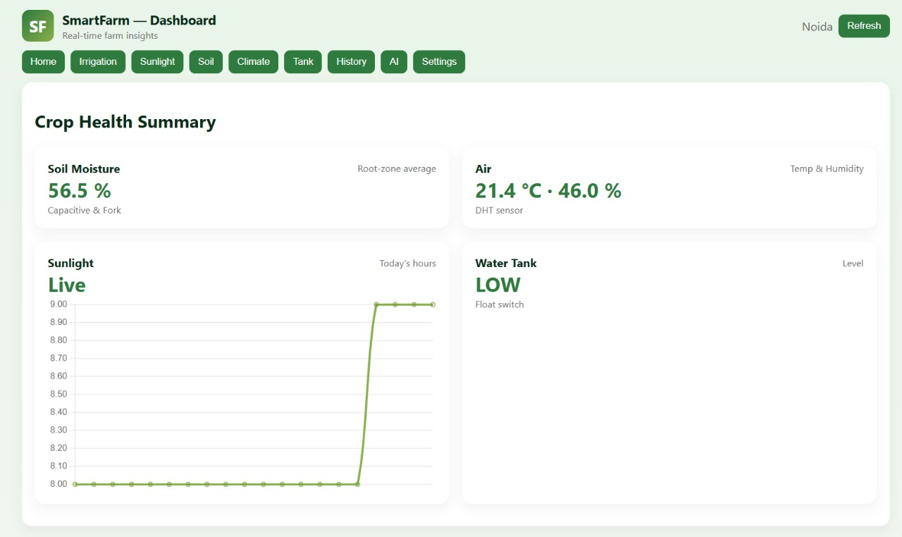
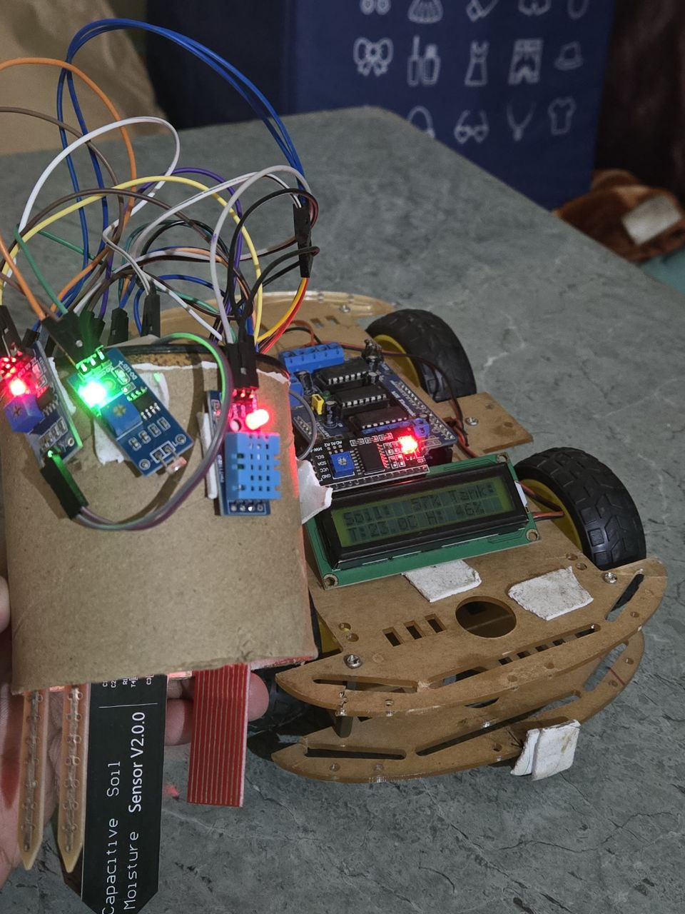

<h1 align="center">🌱 Smart AgriBot</h1>

<b>IoT-Based Smart Farming & Precision Agriculture System</b> 
ESP32 • Sensors • Real-Time Dashboard • Cloud Analytics

  
  
  

---

## 🚜 Overview
Smart AgriBot is an **end-to-end smart agriculture system** designed to monitor and analyze critical farm parameters in real time.  
It collects data from multiple sensors deployed in the field, processes calibrated readings on an ESP32, and visualizes both **live and historical insights** through a modular cloud dashboard.

The system enables **data-driven farming decisions**, improves irrigation efficiency, and lays the foundation for precision agriculture.

---

## 🎯 Problem Statement
Traditional farming faces challenges such as:
- ❌ Manual soil monitoring  
- ❌ Over/under irrigation  
- ❌ Lack of real-time environmental data  
- ❌ No historical analysis for trends  

Smart AgriBot addresses these issues by providing **continuous monitoring, cloud logging, and actionable insights**.

---

## ✨ Key Features
- 🌾 Dual soil moisture sensing (capacitive + resistive)
- 🌡️ Temperature & humidity monitoring
- ☀️ Sunlight intensity tracking
- 🚰 Water tank level detection
- 📡 Real-time cloud data sync
- 📊 Historical data logging & trend analysis
- 🧩 Modular, scalable web dashboard
- 📟 Local LCD status display

---

## 🧠 System Architecture
Farm Sensors  
↓  
ESP32  
↓  
Firebase Realtime Database  
↓  
Modular Web Dashboard  
↓  
Real-Time + Historical Analytics

---

## 🔧 Hardware Components
- ESP32 (WiFi-enabled microcontroller)
- Capacitive Soil Moisture Sensor
- Resistive Soil Moisture Sensor
- DHT11 (Temperature & Humidity)
- LDR (Sunlight Intensity)
- Float Switch (Water Tank Level)
- 16×2 I²C LCD Display

---

## 🌐 Web Dashboard Features
- 📊 Live sensor cards (soil, climate, sunlight, tank)
- 📈 Real-time charts & historical graphs
- 🧠 Modular component-based UI
- 🔄 Live data forwarding with fallback sync
- ⚙️ Expandable for multi-zone farms

---

## ☁️ Cloud & Backend
- **Firebase Realtime Database**
- Structured paths for realtime & history data
- REST-based communication from ESP32
- Scalable data model for future expansion

---

## 🛠️ Tech Stack

### Hardware
- ESP32
- Soil Moisture Sensors
- DHT11
- LDR
- Float Sensor
- LCD Display

### Software
- HTML, CSS, JavaScript
- Chart.js
- Firebase Realtime Database
- REST APIs

---

## 📂 Repository Structure
Smart-AgriBot/  
├── firmware/ # ESP32 source code  
├── dashboard/ # Web dashboard  
│ ├── components/ # Modular UI components  
│ ├── app.js  
│ └── style.css  
├── Hardware Prototype  
└── README.md

---

## 📸 Screenshots

---

## 🌍 Applications
- Precision Agriculture
- Smart Irrigation Systems
- AgriTech Research
- Greenhouse Monitoring
- Smart Farms

---

## 🚀 Future Enhancements
- Automated irrigation control
- AI-based crop recommendation
- Weather API integration
- Mobile app dashboard
- Multi-field farm support

---

## 👤 Author
**Shlok**  
Electrical & Electronics Engineering  

> Built with a focus on real-time systems, scalability, and practical agricultural impact.
